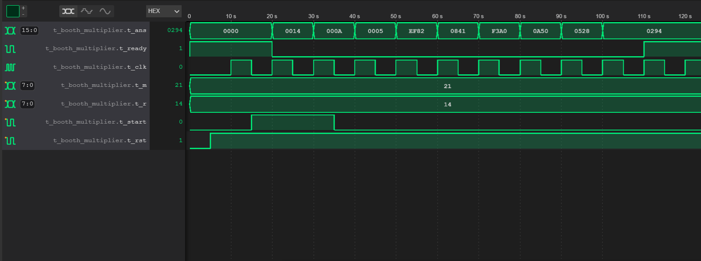

# Booth Multiplier
This is a multiplier algorithm for signed numbers. This algorithm has low power requirements and use less gates. But it requres many clock cycles.

This contains many files
main.v -> sequential implemetation of Booth multiplier with correction by adding 1 more bit in A S P
booth_multiplier2_new_correction_method -> uses different approach to correct the most negative number.

## correction for most negative numbers
For most negative number normal booth multiplier dosen't work so we need to use modified booth algorith. If we observe the results carefully we can see that for most negative numbers we get wrong sign for number but we get correct magnitue. So, we can use method suggested by wikipedia adding 1 bit for A,S,P or we can reverse sign for case of most negative numbers.

## Test bench
t_main.v ->This testbench takes 33 as multiplicand and 20 as multiplier

From the Waveform we can see that result is as expected

t_main2.v -> uses all possible combinations and count the number of errors (missmatched values) at end.

## Reference
[Wikipedia](https://en.wikipedia.org/wiki/Booth%27s_multiplication_algorithm)

